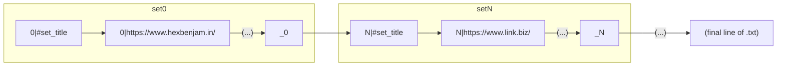

# replicant_search.py

### a **command line tool** for assembling search engine links, specifically with the intention of searching multiple specific domains at once.

---

**This is my first semi-serious development project, and even then it was mostly intended for practice.** If you have advice or ideas to contribute after peeking at the code, please feel free to create a pull request &/or reach out. I think, at minimum, this could become somewhat useful to some folks. Contact information at the end of this file.

NOTE: **replicant_search was built on Windows 10,** but should be at least near-working on other platforms. I lack the means to test for Mac and Linux, so please let me know if you do!

> "Development is only the most recent addition to a long list of hobbies for me, one of which is 3D printing. Some services ([yeggi](https://www.yeggi.com/) comes to mind) already exist to index results across multiple community repositories of 3D models for printing, but I wanted a little more than that. The list of indexed services is fixed, and sometimes I'd like to crawl multiple sites for something that *isn't* a .stl file. Google's Advanced Search page can accomplish a whole lot, but combining scope domains is less than simple. Hence, replicant_search was born!"

***

### Feature overview
#### Current features:
* Constructs + opens a Google or Google Images (only Google... for now) search link, aimed at a preset list of domains, from a typed query.
* Parses input 'scopes.txt', a newline-separated list of URLs, and divides it into sets. These sets can be selected (and listed) from within the console.

##### Planned upgrades
* Scope set definition from the command line
* More search engines!
* GUI (depending on further research)

***

### Usage
1. Download the latest version from the Releases page. Run the installer, which will unpack required files into the folder the installer is in.
2. Edit the *scopes.txt* file, which was extracted from the installer.
3. Enter one target site per line, separated with a line break. The formatting is as follows:

> NOTE: the scopes.txt file included with the program also describes this formatting in its header.

4. Run `replicant_search.exe` to invoke the program. The command window will prompt you further!

> **Remember**  that you should *rarely* need a more specific URL than 'https://www.web.site/'. The search engine will look for results on all the subpages either way. The tool is currently only configured to parse ":" and "/" characters for the time being, so longer-form links with other special characters may cause errors.

***

## Contact
Benjamin Adase / Hex Benjamin  
website: https://hexbenjam.in/  
email: <banjo@hexbenjam.in>  
discord: [@hex benjamin#1738](https://discord.com/users/215846135649140747)  

***

*README was last updated on 06/14/2022.*